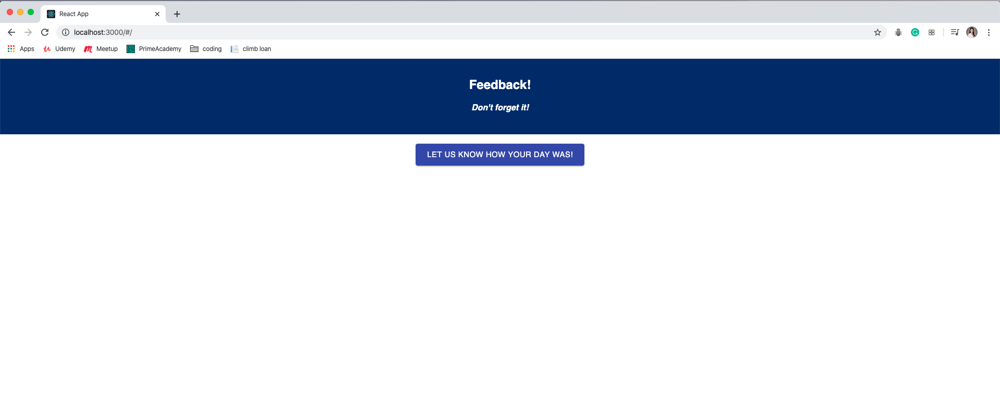
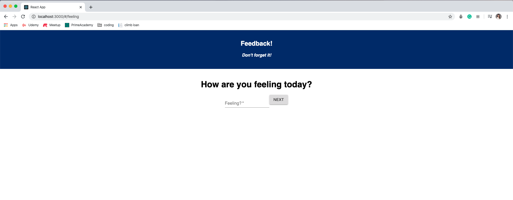
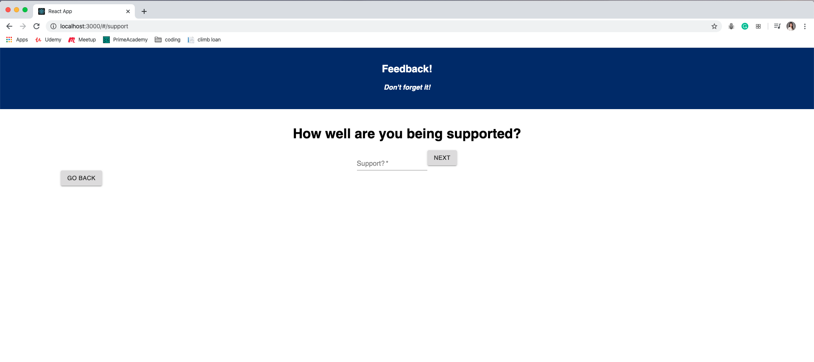
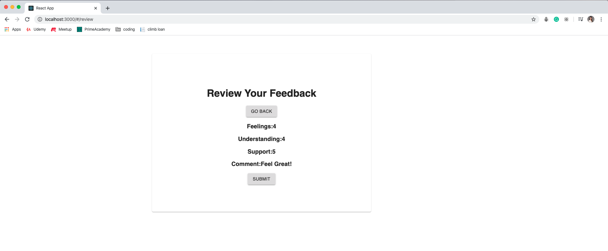
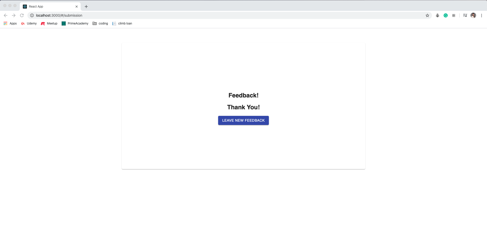
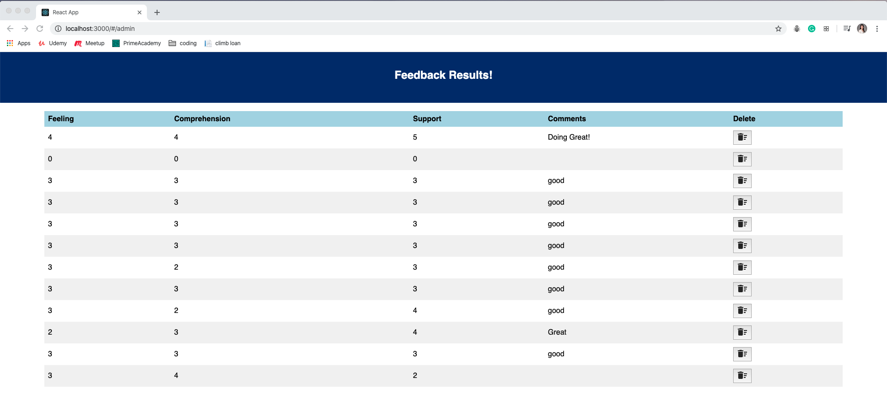

# Redux feedback form

## Description

Duration: 2 days / weekend challenge

This is a full stack application that allows users to leave feedback. Built with React, Redux, axios, JavaScript, SQL

- every line of code has comment explaining its purpose

## Usage

- User can leave ratings or comment. The user can use 'Next' button to move to the next page.
- User can use 'Go Back' button to go to the previous page and change their score.
- The user can review their feedback before submit.
- Once the feedback is submitted, the user can take a new survey by clicking 'Leave New Feedback' button
- Admin page displays all of the existing feedback

### SETUP

Create your database and tables using the provided `data.sql` file. Start the server.

```
npm install
npm run server
```

Now that the server is running, open a new terminal tab with `cmd + t` and start the react client app.

```
npm run client
```

## Screenshot







